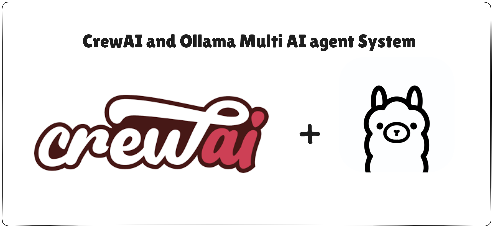

# Multi-AI Agents for Researching and Writing Articles

This project implements a multi-agent system for automating the research, writing, and editing of articles using [CrewAI](https://github.com/joaomdmoura/crewAI) and [Ollama](https://ollama.com/). The system is designed to simulate a collaborative editorial workflow with distinct AI agents: **Planner**, **Writer**, and **Editor**.

## Project Structure

The system is composed of the following AI agents, each with specialized roles:

### 📝 Planner
- **Purpose**: Collects and plans the content of the article.
- **Tasks**:
  - Gathers relevant information and sources.
  - Structures the article outline.
  - Defines key points and sections for the article.

### ✍️ Writer
- **Purpose**: Contributes original content and opinions about the planned topics.
- **Tasks**:
  - Expands on the planner's outline.
  - Provides detailed explanations, arguments, and insights.
  - Ensures content richness and diversity of thought.

### 🛠️ Editor
- **Purpose**: Refines and adjusts the article to maintain consistency and adhere to a specific style.
- **Tasks**:
  - Edits the content for clarity, coherence, and flow.
  - Applies stylistic adjustments to match the desired tone and voice.
  - Ensures grammatical correctness and overall quality.

## 🚀 Technologies Used

- **CrewAI**: Orchestrates the interaction and coordination between multiple AI agents.
- **Ollama**: Provides local LLMs (Large Language Models) for efficient and privacy-respecting AI capabilities.

## 🏗️ Features

- Modular agent-based architecture.
- Automated pipeline for researching, writing, and editing.
- Customizable agent prompts and behaviors.
- Scalable design for adding more agents or roles in the future.

## 🔧 Setup Instructions

1. **Clone the repository**:
   ```bash
   git clone https://github.com/diogojfr/researcher-and-writer-articles-multiagents.git
   cd multi-ai-agents

2. **Install dependencies**:

    Ensure you have Python 3.12+ and install required packages:
    ```bash
    pip install -r requirements.txt

3. **Install and configure Ollama**:

    Follow the instructions at [Ollama's official site](https://ollama.com/) to set up local LLMs.

4. Configure agent prompts:

    Modify the agent prompt templates in the agents/ directory to suit your article topics and desired styles.

5. Run the system:
    ```bash
    python src/researcher_writer_agents/main.py


## 📁 Project Directory

    researcher-and-writer-articles-multiagents/
    ├── src/
    |   ├──researcher_writer_agents/
    |      ├──config/
    |      |  ├── agents.yml
    |      |  ├── tasks.yml
    |      ├── crew.py
    |      ├── main.py
    |      ├── __init__.py
    ├── outputs/
    ├── README.md
    └── requirements.txt

## 🛠️ Customization

    You can fine-tune each agent's behavior by editing their respective prompt templates in the tasks.yml file.

    Additional agents can be added to expand capabilities (e.g., Fact Checker, SEO Optimizer).